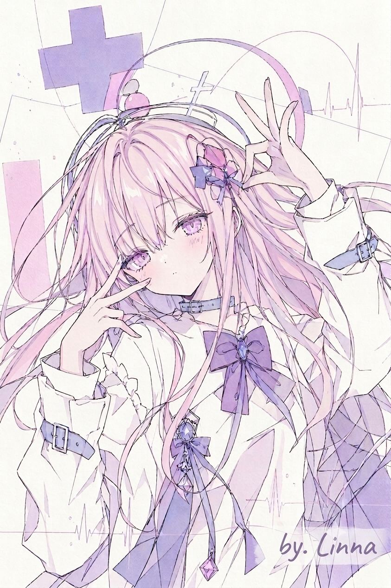

<div align="center">



<br>

# HnsSkin — CS 1.6 独立皮肤系统（含 DLC 扩展）

[]()
[]()
[]()
[]()
[]()

> 一款**完全独立**的 Counter-Strike 1.6 AMX Mod X 皮肤插件。
> 不依赖任何比赛系统，即插即用；同时提供 DLC 扩展（音效、饰品配件）。
>
> **维护者 / 联系人：LINNA**
>
> Art by Linna

</div>

---
## 目录

- [示例图](#示例图)
- [深入指南 GUIDE](#深入指南-guide)
- [这是什么](#这是什么)
- [项目结构](#项目结构)
- [工作原理：它是怎么触发的](#工作原理它是怎么触发的)
  - [皮肤系统 HnsSkin.sma](#皮肤系统-hnsskinsma)
  - [DLC 音效 HnsDlcSkin.sma](#dlc-音效-hnsdlcskinsma)
  - [DLC 饰品 HnsDlcAccessory.sma](#dlc-饰品-hnsdlcaccessorysma)
- [技术栈与语言](#技术栈与语言)
- [安装方法](#安装方法)
- [配置文件说明](#配置文件说明)
- [命令列表](#命令列表)
- [未来可扩展方向](#未来可扩展方向)
- [如何二次开发与维护](#如何二次开发与维护)
- [开源协议](#开源协议)

---

## 示例图

以下是游戏内实际效果截图，展示不同皮肤模型在 CS 1.6 场景中的展示效果：

<div align="center">


</div>

---
## 深入指南 GUIDE

对于开发者和服主，这份文档解答三件事：

1. **代码怎么形成的** — 架构与触发原理
2. **适用/不适用哪些服** — 审辨判断标准
3. **僵尸服接入 + 模式自动切换** — 加“模式适配器”实现

详见 [《GUIDE.md》](GUIDE.md)。

---

## 这是什么

HnsSkin 是一个**独立的皮肤加载/发放系统**。核心插件 `HnsSkin.sma` 只负责一件事：**让玩家能用上自定义的 T / CT / 刀皮肤**，并通过 `nvault` 永久记住每个玩家拥有哪些皮肤。

它被设计成**完全独立**的插件：

- 不 include 任何比赛系统头文件
- 不依赖比赛系统的 Forward / Native
- 关闭比赛系统它照样工作
- 放到任何 CS1.6 + AMX Mod X 服务器都能跑

在它之上，`dlc/` 目录下还有两个**可选扩展**，组成一个完整的"皮肤 + 音效 + 饰品"生态：

| 扩展 | 功能 | 是否必须 |
|------|------|----------|
| `HnsSkin.sma` | T / CT / 刀皮肤加载与发放 | 必须 |
| `HnsDlcSkin.sma` | 按皮肤模型替换死亡音效、刀击音效 | 可选 |
| `HnsDlcAccessory.sma` | 头部 / 背部 / 面部饰品（帽子、翅膀等） | 可选 |

---

## 项目结构

```
hns-skin-system/
├── HnsSkin.sma              ← 核心皮肤系统（独立运行）
├── player_models.ini        ← 皮肤配置（T / CT / 刀模型库）
├── LICENSE                  ← GPLv3 开源协议
├── assets/
│   └── preview.png          ← 预览图
├── compiled/
│   ├── HnsSkin.amxx            ← 编译产物（含 WPM 集成）
│   └── addon_weapon_player_model.amxx ← WPM API 依赖插件
├── include/
│   └── api_weapon_player_model.inc   ← WPM API 头文件
├── models/
│   └── p_null.mdl            ← WPM 附件移动占位模型
└── dlc/
    ├── HnsDlcSkin.sma       ← DLC：音效扩展（死亡音效 / 刀击音效）
    ├── HnsDlcAccessory.sma  ← DLC：饰品扩展（帽子 / 翅膀 / 面部）
    └── configs/
        ├── dlc_skin.ini     ← 音效配置
        └── dlc_accessory.ini← 饰品配置
```

---

## 工作原理：它是怎么触发的

### 皮肤系统 HnsSkin.sma

**触发链路（选皮肤 → 应用模型）：**

```
玩家输入 /skin
   │
   ├─→ 解析命令 register_clcmd("say /skin", ...)
   │
   ├─→ 读取玩家鉴权信息（SteamID 或 IP，正版/盗版都支持）
   │
   ├─→ 从 nvault 读取该玩家已拥有的皮肤列表 & 当前选择
   │       键名前缀 skinsys_，文件：data/vault/skinsys_skin_vault.vault
   │
   ├─→ 弹出分页菜单（T / CT / 刀三个子菜单）
   │
   └─→ 玩家选定后，写入 nvault 并立即应用：
         - T/CT 皮肤 → 调用引擎 SetModel 换身体模型
         - 刀皮肤    → 同时设置 pev_viewmodel2（自己看）
                        pev_weaponmodel2（别人看）
                        + WPM follow 实体（更可靠的第三人称渲染）
```

**关键触发点：**

1. **命令触发**：`register_clcmd` 拦截 `/skin`、`/skin_t`、`/skin_ct`、`/skin_knife`。
2. **重生触发**：用 ReGameDLL 的 `RegisterHookChain(RG_CBasePlayer_Spawn, ...)`，玩家每次重生自动重新套用已选皮肤，避免换图/死亡后丢失。
3. **切刀触发**：拦截 `CurWeapon` 消息，切到刀时自动重新应用刀皮肤，防止视角内模型丢失。
4. **数据持久化**：所有选择写进 `nvault`，重连、重启服务器都不丢。

### DLC 音效 HnsDlcSkin.sma

**触发链路：**

```
玩家死亡 OnPlayerKilled
   └─→ 读取玩家当前身体模型路径（models/player/xxx/xxx.mdl）
        └─→ 在 dlc_skin.ini 的 [DeathSounds] 里查找匹配项
             └─→ 命中则 emit_sound 播放自定义死亡音效（同模型可配多个，随机播）

玩家挥刀/击中/重击
   └─→ 缓存当前刀模型 → 在 [KnifeSounds] 匹配
        └─→ Ham_PrimaryAttack = 挥砍音效
        └─→ Ham_SecondaryAttack = 重击音效
        └─→ Ham_TraceAttack = 击中音效
```

刀音效通过 `RegisterHam` 挂在 `weapon_knife` 上，实现"左键挥砍、右键重击、砍中人"三种独立音效。

### DLC 饰品 HnsDlcAccessory.sma

**触发链路：**

```
玩家输入 /acc 或 /accessory
   └─→ 弹出饰品菜单（hat 头部 / back 背部 / face 面部）
        └─→ 玩家选择 → 写入 nvault
             └─→ 玩家重生 OnPlayerSpawn
                  └─→ 创建 info_target 实体，SetModel 挂上饰品模型
                       └─→ 每 0.5 秒定时任务跟随玩家坐标/朝向刷新位置
                            （背部饰品用 angle_vector 计算背后偏移）
```

饰品用 `MOVETYPE_FOLLOW` 跟随玩家，`pev_aiment` 绑定到玩家实体，做到"挂在身上但不会穿透"。

---

## 技术栈与语言

| 项 | 说明 |
|----|------|
| **语言** | Pawn（AMX Mod X 脚本语言，C 风格） |
| **运行环境** | Counter-Strike 1.6 + AMX Mod X 1.8.3+ |
| **依赖模块** | `amxmodx`、`fakemeta`、`amxmisc`、`reapi`、`nvault`、`hamsandwich`、`engine`、`api_weapon_player_model`（WPM） |
| **编译工具** | `amxxpc`（AMX Mod X 自带编译器） |
| **数据存储** | `nvault`（AMXX 内置持久化键值库） |

> Pawn 是 AMX Mod X 的官方脚本语言，语法类似 C，但用 `new` 声明变量、用 `stock` 声明可复用函数。所有 CS 插件（包括比赛系统）都用它写，编译产物是 `.amxx` 二进制插件。

---

## 安装方法

源码优先，编译后放入服务器：

```bash
# 1. 编译（把脚本放到 AMXX 的 scripting/ 目录）
amxxpc HnsSkin.sma
amxxpc dlc/HnsDlcSkin.sma
amxxpc dlc/HnsDlcAccessory.sma
```

```bash
# 2. 把生成的 .amxx 复制到 plugins 目录
cp *.amxx <cstrike>/addons/amxmodx/plugins/

# 3. 在 plugins.ini 里启用
# ⚠️ WPM 依赖插件必须放在 HnsSkin.amxx 之前加载
echo "addon_weapon_player_model.amxx" >> <cstrike>/addons/amxmodx/configs/plugins.ini
echo "HnsSkin.amxx" >> <cstrike>/addons/amxmodx/configs/plugins.ini
echo "HnsDlcSkin.amxx" >> <cstrike>/addons/amxmodx/configs/plugins.ini
echo "HnsDlcAccessory.amxx" >> <cstrike>/addons/amxmodx/configs/plugins.ini
```

```bash
# 4. 复制配置文件
mkdir -p <cstrike>/addons/amxmodx/configs/mixsystem/
cp player_models.ini                <cstrike>/addons/amxmodx/configs/mixsystem/
cp dlc/configs/dlc_skin.ini         <cstrike>/addons/amxmodx/configs/mixsystem/
cp dlc/configs/dlc_accessory.ini    <cstrike>/addons/amxmodx/configs/mixsystem/

# 5. 复制 WPM 依赖
cp compiled/addon_weapon_player_model.amxx <cstrike>/addons/amxmodx/plugins/
cp models/p_null.mdl                <cstrike>/models/
```

```bash
# 6. 重启服务器或换图生效
amxx plugins   # 确认四个插件都已加载
```

> **注意**：`HnsDlcSkin.sma` 和 `HnsDlcAccessory.sma` 需要 ReGameDLL。若服务器未装，可只部署 `HnsSkin.amxx`。
> **注意**：`addon_weapon_player_model.amxx` 是第三人称刀皮的硬依赖，未加载时 HnsSkin 会因找不到 native 而无法启动，务必安装。

---

## 配置文件说明

### `player_models.ini`（皮肤配置）

```ini
[T]
显示名称 models/player/文件夹/模型.mdl

[CT]
显示名称 models/player/文件夹/模型.mdl

[Knife]
显示名称 models/v_knife.mdl
```

刀模型只需填 `v_knife.mdl`，插件会自动把 `p_knife.mdl` 设为第三人称模型，并通过 WPM follow 实体稳定渲染（即使玩家套了自定义人物模型也能正常显示）。

### `dlc_skin.ini`（音效配置）

```ini
[DeathSounds]
"models/player/arctic/arctic.mdl" "dlc/death_arctic.wav"

[KnifeSounds]
"models/v_knife.mdl" "dlc/knife_slash.wav" "dlc/knife_hit.wav" "dlc/knife_stab.wav"
```

音效文件放 `<cstrike>/sound/` 目录。同一模型可写多行死亡音效，死亡时随机播放一个。

### `dlc_accessory.ini`（饰品配置）

```ini
[hat]
"圣诞帽" "models/accessory/santa_hat.mdl" "0 0 36" "1.0"

[back]
"天使翅膀" "models/accessory/angel_wings.mdl" "-8 0 20" "1.0"

[face]
"墨镜" "models/accessory/sunglasses.mdl" "0 0 32" "1.0"
```

格式：`"名称" "模型路径" "坐标偏移X Y Z" "缩放比例"`。模型放 `<cstrike>/models/` 目录。

---

## 命令列表

### 皮肤系统

| 命令 | 说明 | 权限 |
|------|------|------|
| `/skin` | 打开皮肤主菜单 | 所有人 |
| `/skin_t` | 直接打开 T 皮肤选择 | 所有人 |
| `/skin_ct` | 直接打开 CT 皮肤选择 | 所有人 |
| `/skin_knife` | 直接打开刀皮肤选择 | 所有人 |
| `/giveskin` | 打开皮肤发放菜单 | 管理员 |
| `/giveallskins` | 批量发放全部皮肤 | 管理员 |
| `/giveskinid` | 命令行发放皮肤 | 管理员 |

### DLC 音效

| 命令 | 说明 | 权限 |
|------|------|------|
| `/dlc_reload` | 重载音效配置 | ADMIN_RCON |

### DLC 饰品

| 命令 | 说明 | 权限 |
|------|------|------|
| `/acc` / `/accessory` | 打开饰品菜单 | 所有人 |
| `/acc_reload` | 重载饰品配置 | ADMIN_RCON |

---

## 未来可扩展方向

这套架构刻意做成了"配置驱动 + 事件驱动"，扩展点非常清晰：

1. **无限皮肤池**：往 `player_models.ini` 加模型行即可，菜单自动分页，无需改代码。

2. **更多 DLC 槽位**：`HnsDlcAccessory.sma` 目前有 `hat/back/face` 三个槽位，可扩展 `MAX_SLOTS` 增加宠物、光环、脚印等。

3. **音效精细分级**：目前死亡音效按"模型"匹配，可扩展为按"击杀方式/武器/连杀数"匹配，做出连杀音效、爆头音效。

4. **皮肤交易/合成**：基于已有的 nvault 拥有列表，可加 `/trade` 交易系统或皮肤合成系统。

5. **Web 后台管理**：可对接数据库（SQLite/MySQL）替代 nvault，配合 Web 面板做皮肤商城、积分兑换。

6. **与比赛系统联动**：虽然 HnsSkin 本身独立，但可通过 `hns_match_finished` 等 Forward 在比赛结束后给获胜方发放限定皮肤。

7. **第一人称特效**：基于 ReGameDLL 可加粒子、发光、特效枪皮等，让 DLC 生态更丰富。

---

## 如何二次开发与维护

**开发环境：**

1. 安装 AMX Mod X SDK（含 `amxxpc` 编译器与 `include/` 头文件）。
2. 把 `scripting/` 与本项目的源码文件放到一起，确保能 include 到 `reapi.inc`、`fakemeta.inc` 等。
3. 改完 `.sma` 后编译：`amxxpc 你的插件.sma`。
4. 在测试服务器 `amxx plugins` 确认加载无报错。

**维护约定：**

- 所有配置都走 `.ini`，不要硬编码模型/音效路径。
- 新增可复用函数用 `stock` 声明，方便其他插件调用。
- nvault 键名统一加前缀（如 `skinsys_`、`dlcacc_`），避免冲突。
- 改完记得更新 `dlc_*.ini` 的注释示例，保持文档与实现同步。

**遇到问题：**

- 插件没加载 → 看 `addons/amxmodx/logs/` 下的错误日志，确认模块是否齐全。
- 模型闪成原始 → 检查 `player_models.ini` 路径是否大小写一致、模型是否已 `precache`。
- DLC 无音效 → 确认 ReGameDLL 已装，且音效已 `precache_sound`。

---

## 版本更新日志

### v2.0.0（2026-08-10）— 第三人称刀皮肤 WPM 增强

**🆕 新增内容**

| 新增 | 说明 |
|------|------|
| 第三人称刀皮肤 WPM 渲染 | 接入 [Weapon Player Model API](https://github.com/YoshiokaHaruki/AMXX-API-Weapon-Player-Model)，用 `MOVETYPE_FOLLOW` 独立实体跟随玩家骨骼渲染刀皮，彻底解决"玩家套自定义模型后第三人称刀皮失效"的老问题 |
| `hns_skin_wpm` 开关 | 新增 cvar（默认 `1` 开启），可设 `0` 关闭并回退到传统的 `pev_weaponmodel2` 渲染 |
| WPM 依赖文件 | 附带 `addon_weapon_player_model.amxx`、`api_weapon_player_model.inc`、`p_null.mdl`，开箱即用 |

**🔧 改动点**

- `set_player_knife_view()` 在原有第一/第三人称设置后，追加 `api_wpn_player_model_set()` 创建 follow 实体渲染刀皮
- `client_disconnected()` 追加 `api_wpn_player_model_remove()` 清理实体
- 新增 `addon_weapon_player_model.amxx` 为硬依赖，需与 `HnsSkin.amxx` 同时加载

**⚠️ 升级提示**

- 替换 `HnsSkin.amxx` 的同时，必须安装 `addon_weapon_player_model.amxx`（放在 `HnsSkin.amxx` 之前加载），否则插件无法启动。
- 已有玩家皮肤数据（nvault）不受影响，自动保留。

### v1.1.1（2026-08-10）— 修复换队后默认皮肤不跟随阵营

**🔧 修复内容（核心）**

| 修复 | 说明 |
|------|------|
| 换队后「默认皮肤」不跟随阵营 | **根因**：`rg_reset_user_model(id)` 默认 `update_index=false`，只重置模型标识字符串，**不刷新可见模型**。玩家未选择皮肤（默认皮肤）换队时，旧阵营模型残留，导致 T 穿上 CT 衣服、或警察刀匪变匪后皮肤不变。**修复**：改为 `rg_reset_user_model(id, true)`，换队时立即刷新可见模型到新阵营默认 |
| 刀切武器皮肤丢失 | 修正 `CurWeapon` 消息回调参数：`register_message` 回调签名是 `(msg_id, dest, in_entity)`，玩家 id 取第 3 个参数 `in_entity`，避免误用 msg_id 导致切刀后视角刀皮被还原 |

**⚠️ 升级提示**

- 直接替换 `HnsSkin.amxx` 即可。此项修复同时已同步至服务器实际使用的 `HnsMatchSkin.amxx`。

### v1.1.0（2026-08-10）— 修复多项 bug + 新增 USP 皮肤

**🆕 新增内容**

| 新增 | 说明 |
|------|------|
| USP 皮肤系统 | 新增完整的第一人称视角 USP 枪械皮肤支持，玩家可选择自定义 USP 模型 |
| `/skin_usp` 命令 | 直接打开 USP 皮肤选择菜单 |
| USP 皮肤回退机制 | 所选模型文件不存在时自动回退默认 USP，避免视角模型丢失/报错 |

**🔧 修复内容**

| 修复 | 说明 |
|------|------|
| 换队后皮肤不刷新 | 通过捕获 `TeamInfo` 事件，玩家换队时立即重新套用对应阵营皮肤，不再闪回默认模型 |
| 切武器视角模型丢失 | 新增 `Ham_Item_Deploy` 钩子，切到刀/USP 时自动重新应用已选皮肤 |
| 刀皮肤切换丢失 | 修正 `CurWeapon` 消息拦截逻辑，切刀时视角内模型保持正确 |
| 模型缺失兼容 | 皮肤文件不存在时安全回退默认模型，不再闪成原始模型或报错 |

**📁 配置更新**

- `player_models.ini` 新增 `[USP]` 分区，用于配置 USP 皮肤模型库。

**⚠️ 升级提示**

- 直接替换 `HnsSkin.amxx` 并覆盖 `player_models.ini` 即可，已有玩家皮肤数据（nvault）不受影响、自动保留。

### v1.0.0（初始版本）

- 独立皮肤系统首版发布：T / CT / 刀皮肤加载与发放、`nvault` 持久化、分页菜单。
- 附带 DLC 扩展：音效（`HnsDlcSkin.amxx`）与饰品（`HnsDlcAccessory.amxx`）。

---

## 开源协议

本项目基于 **GPLv3** 协议开源，自由使用、修改和分发。

---

**HnsSkin Skin System** — Built with passion for the CS 1.6 HNS community.
维护者：**LINNA**

---

<div align="center">

### <span style="color:red">⚠️ 严令禁止倒卖插件 ⚠️</span>

<span style="color:red">**本项目为原创独立开发作品，严禁任何形式的倒卖、转售或商业牟利行为！**</span>

<span style="color:red">源码已开源仅供学习交流与个人使用，未经授权不得将其打包、改头换面后用于收费出售、捆绑销售或二次分发获利。</span>

<span style="color:red">**一经发现，将直接追究相关法律责任，并停止后续更新与技术支持。**</span>

<span style="color:#ff8c00">如发现有人倒卖本插件，欢迎向维护者 **LINNA** 举报。</span>

</div>